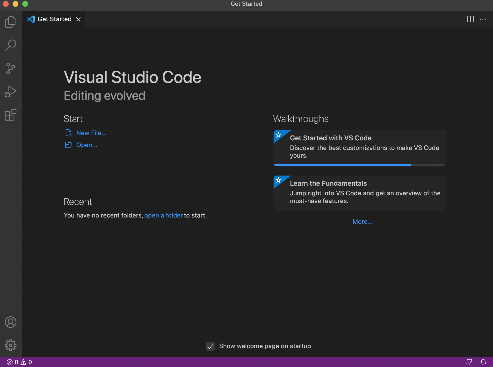
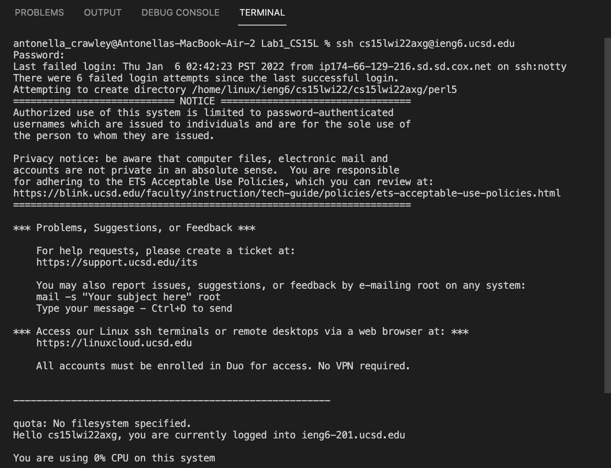
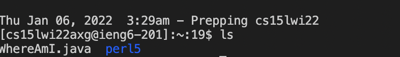
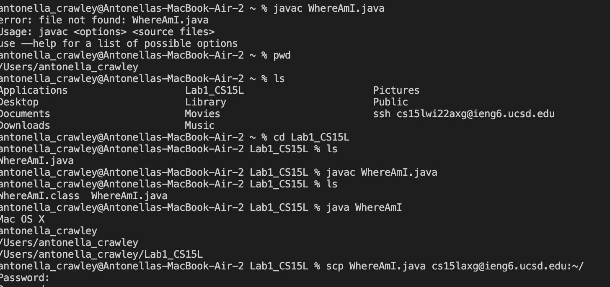
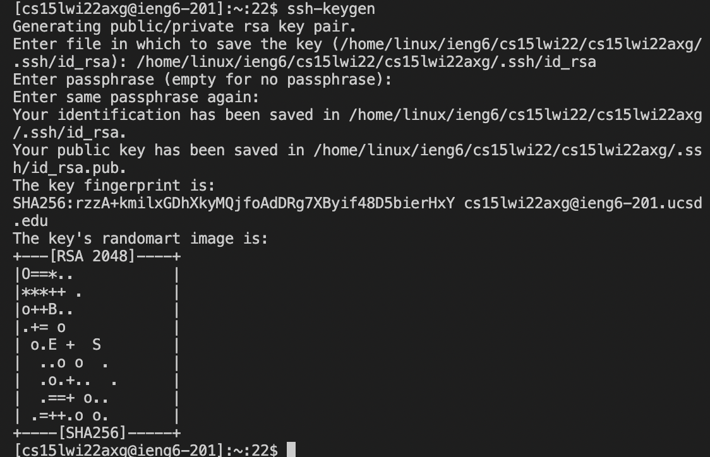
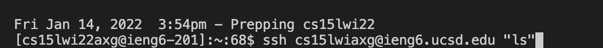

# Lab Report 1 - Week 2
In our first week of CSE15L, we learned how to set up our computer to remotely access the CSE lab computers. We will be able to complete this in 6 steps.
<br/><br/>

## Installing VScode
First, you will want to go to [VScode](https://code.visualstudio.com/) and follow the given instructions to download VScode. After it is successfully installed, it should look something like this:


## Remotely Connecting
Since we are using a course specific account, it will benefit us to know how to use VScode to connect to a remote computer. Since I am on a mac, I do not need to install openSSH and we can skip to looking up our course-specified account for CSE15L:
[https://sdacs.ucsd.edu/~icc/index.php](https://sdacs.ucsd.edu/~icc/index.php)
Open your terminal in VScode, and input this (except with your course-specified account):
```
$ ssh cs15lwi22zz@ieng6.ucsd.edu
```
After you type yes, your terminal should look something like this:


## Trying Some Commands
Now we can have some fun using the terminal. Let’s try running some commands. Here are a few we can use:
```
- cd ~
- cd
- ls
- ls -lat
- ls -a
- ls <directory> where <directory> is /home/linux/ieng6/cs15lwi22/cs15lwi22abc, where the abc is one of the other group members’ username
- cp /home/linux/ieng6/cs15lwi22/public/hello.txt ~/
- cat /home/linux/ieng6/cs15lwi22/public/hello.txt
```
Here is an example of running one of the listed commands in the terminal:


## Moving files with scp
This lab includes a .java file called WhereAmI.java. Here is the following code:
```
class WhereAmI {
  public static void main(String[] args) {
    System.out.println(System.getProperty("os.name"));
    System.out.println(System.getProperty("user.name"));
    System.out.println(System.getProperty("user.home"));
    System.out.println(System.getProperty("user.dir"));
  }
}
```
Run WhereAmI.java using java or javac in the terminal. 
In the terminal, we will run this command (with your designated account):
```
scp WhereAmI.java cs15lwi22zz@ieng6.ucsd.edu:~/
```
Which will then prompt you to enter your password. Then when you log in using ssh again, type the command “ls” and it should appear. Once it does appear, run it using javac and java. 


## Setting an SSH Key
We will use ssh-keys to avoid having to retype your password every time we log into or run scp. The following attached is what you need to run in the terminal:

There are now two new files in your system, the private key and the public key, which are both stored in the .ssh directory of your computer. Finally, copy the public key to the .ssh directory of your account on the server. 
```
$ ssh cs15lwi22zz@ieng6.ucsd.edu
<Enter Password>
# now on server
$ mkdir .ssh
$ <logout>
# back on client
$ scp /Users/joe/.ssh/id_rsa.pub cs15lwi22@ieng6.ucsd.edu:~/.ssh/authorized_keys
# You use your username and the path you saw in the command above
```
## Optimizing Remote Running
Now we will come up with the most ideal process for making a local edit to WhereAmI.java. Next, we will copy it to the remote server and run it. We can use

to log in. Now you have successfully set up your computer to remotely access the CSE lab computers!
```
antonella_crawley@Antonellas-MacBook-Air-2 Lab1_CS15L % scp WhereAmI.java cs15lwi22axg@ieng6.ucsd.edu:~/
Enter passphrase for key '/Users/antonella_crawley/.ssh/id_rsa': 
WhereAmI.java                                                                           100%  304     9.3KB/s   00:00    
antonella_crawley@Antonellas-MacBook-Air-2 Lab1_CS15L % ssh cs15lwi22axg@ieng6.ucsd.edu "javac WhereAmI.java; java WhereAmI"
Enter passphrase for key '/Users/antonella_crawley/.ssh/id_rsa': 
Linux
cs15lwi22axg
/home/linux/ieng6/cs15lwi22/cs15lwi22axg
/home/linux/ieng6/cs15lwi22/cs15lwi22axg
antonella_crawley@Antonellas-MacBook-Air-2 Lab1_CS15L % 
```
The total number of keystrokes was 8 keystrokes.