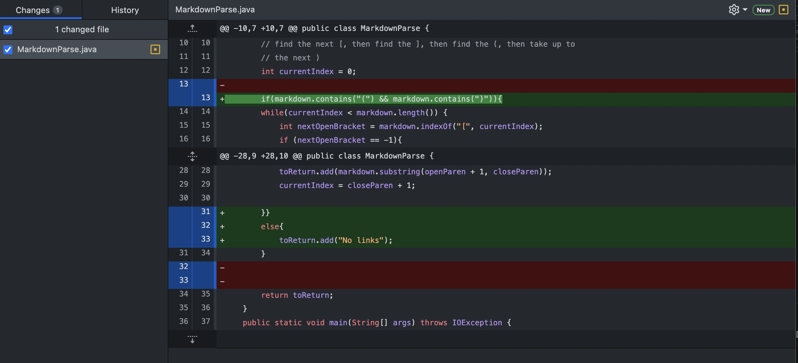

# Lab Report 2 - Week 4
Over the past two weeks, as we worked on labs 3 and 4 we encountered several bugs, which turned into several solutions in  order to create a running program. In Lab Report 2, we will go over 3 different code changes we did in order to fix a bug.

# Bug 1
Code Change:

Link to test file: [Link](https://antnllac.github.io/cse15l-lab-reports/testing)
<br/><br/>
Symptom of Failure Inducing Input:
```
antonella_crawley@Antonellas-MacBook-Air-2 markdown-parse % java MarkdownParse Testing.md
Exception in thread "main" java.lang.StringIndexOutOfBoundsException: String index out of range: -2
        at java.base/java.lang.StringLatin1.charAt(StringLatin1.java:48)
        at java.base/java.lang.String.charAt(String.java:1512)
        at MarkdownParse.getLinks(MarkdownParse.java:22)
        at MarkdownParse.main(MarkdownParse.java:35)

```
The failure inducing input for this bug comes from Testing.md. We know this because we use Testing.md in the terminal to try to get the desired output, which fails (as shown above), which is the symptom of the failure inducing input. We solve this by identifying the bug, which is adding the if statement in lines 16-18.

# Bug 2
Code Change:

Link to test file: [Link](https://antnllac.github.io/cse15l-lab-reports/testing3)
<br/><br/>
Symptom of Failure Inducing Input:
```
antonella_crawley@Antonellas-MacBook-Air-2 markdown-parse % javac MarkdownParse.java     
antonella_crawley@Antonellas-MacBook-Air-2 markdown-parse % java MarkdownParse Testing3.md
[]
```
The failure inducing input for this bug comes from Testing3.md. We know this because we use Testing3.md in the terminal to try to get the desired output, which fails (as shown above), which is the symptom of the failure inducing input. We solve this by identifying the bug, which is adding the if statement in lines 13 and adding the else statement in line 32.

# Bug 3
Code Change:

Link to test file: [Link](https://antnllac.github.io/cse15l-lab-reports/test-file)
<br/><br/>
Symptom of Failure Inducing Input:
```
antonella_crawley@Antonellas-MacBook-Air-2 markdown-parse % javac -cp .:lib/junit-4.13.2.jar:lib/hamcrest-core-1.3.jar MarkdownParseTest.java
MarkdownParseTest.java:22: error: cannot find symbol
        ArrayList<String> links = MarkdownParse.getLinks(contents);
                                                         ^
  symbol:   variable contents
  location: class MarkdownParseTest
1 error

```
The failure inducing input for this bug comes from test-file.md. We know this because we use test-file.md in the terminal to try to get the desired output, which fails (as shown above), which is the symptom of the failure inducing input. We solve this by identifying the bug, which is adding throw IOException to line 19.