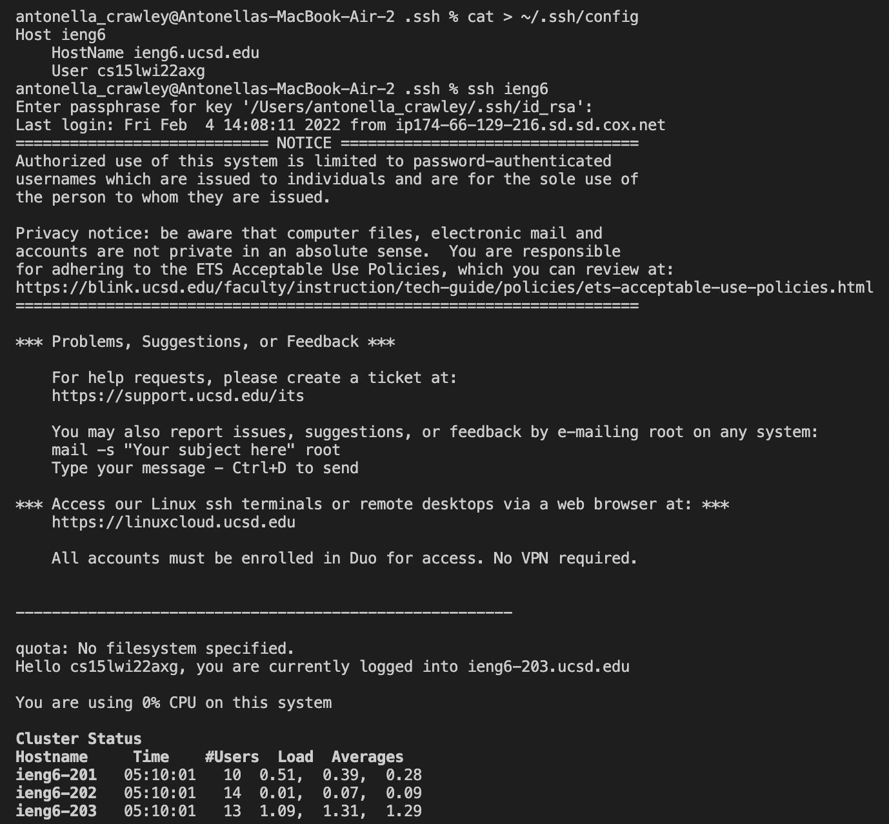
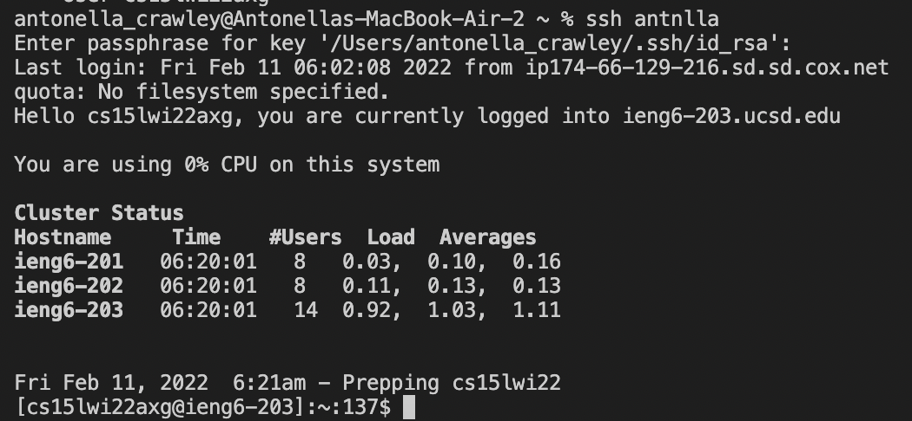
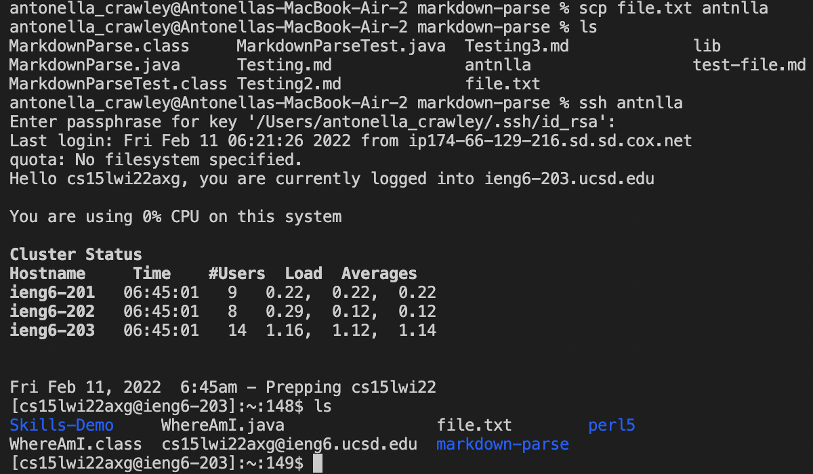

# Lab Report 3 - Week 6
This lab report will go over Streamlining ssh Configuration.
## Show your .ssh/config file, and how you edited it (with VScode, another program, etc)

## Show the ssh command logging you into your account using just the alias you chose.

## Show an scp command copying a file to your account using just the alias you chose.

